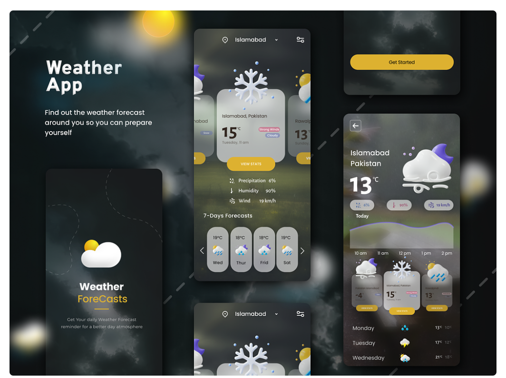

# React-Js weather project

#### Weather forecast application :

- search cities
- display some information regarding the weather forecast for the next few days
- add it to a list of favourites (easy acces)

#### Requirements :

- Search for a city

- Display weather forecast information :
- for the current day in a highlighted position
- Display weather for next few days

- Display error message if the city can not be find
- Add city to a favorite list
- Remove a city from your favorites list
- Display the list with favouristes lists
- local storage

The project need to have [file containing instructions on how to build the project](https://tiloid.com/)

[Weather forecast API](https://openweathermap.org/forecast5)

### My example for my app

#### My Tech's

- Nextjs
- React-Ts
- Tailwindcss
